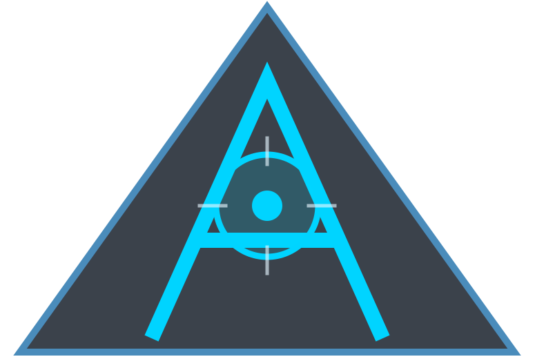

<div align="center">



# ADAM

### A real-time intelligence console for planet Earth. **#houseofasher**

Photorealistic 3D globe · live aircraft, vessels, satellites, earthquakes, fires, traffic, radio and public cameras · hands-free voice analyst.

</div>

---

## Quick start

```bash
npm ci
npm run dev        # http://localhost:4173
```

No API keys are required: the app starts on keyless Esri imagery with the keyless feeds live. Add keys in the in-app **POWER UP** panel (local dev) or in your host's environment variables (Vercel). The panel ranks keys by how much each one unlocks, so if you add only one, add the first one it lists.

Node 24.14+ (or 26) is required. `npm test` runs the unit suite; `npm run build` produces `dist/`.

## Deploy to Vercel

The repository is ready to import into Vercel as-is:

1. **New Project → Import** `shep95/adam`. The settings come from `vercel.json`: Vite framework, `dist/` output, and one serverless function (`api/gateway.js`) that serves every `/api/*` route.
2. Add any keys you want under **Settings → Environment Variables** (see `.env.example`). `GOOGLE_MAPS_API_KEY` and `CESIUM_ION_TOKEN` are compiled into the browser bundle, so restrict them by HTTP referrer to your Vercel domain. Every other key stays server-side.
3. Deploy.

What changes on a hosted deploy:

- **Provider Settings is disabled.** Keys come only from the project environment; the `/api/setup/*` routes are never mounted, so visitors can't read or write credentials.
- **OpenAI voice is rate-limited by default** to 6 requests/min per IP (`GEV_RATELIMIT_OPENAI_PER_MIN` overrides). Also set a spend limit on your OpenAI account.
- **Provider caches are per instance.** They write to the function's temp directory, and warm instances reuse them.
- **AIS vessels are best-effort.** The AISStream socket lives only as long as a warm function instance does. For continuous vessel tracking, run `npm run build && npm run preview` on a long-lived host.

## What ADAM adds on top of the upstream console

See [docs/ADAM.md](docs/ADAM.md) for the full list and how each piece works. In short:

- **Signal-weighted design system.** Three accent tiers (cyan primary, amber alert, red critical), sharp 4px data panels, a fixed 10/13/18px monospace scale, denser glass over photoreal imagery, and panel chrome that follows the sensor mode (NVG phosphor, FLIR ironbow, cyber red).
- **Intelligence.** Rolling activity baselines per layer and region ("activity in this corridor is elevated"), a *brief me* situational summary, a persistent *last tracked* card, user-defined alert triggers, and voice actions split into domain modules.
- **Infrastructure context.** Power lines, pipelines, border crossings, bridges and chokepoints, IXPs, submarine-cable landing stations, a global military-installation toggle, port and TSS zones, and airspace boundaries.
- **Performance.** Batched CCTV setup with lazy viewsheds and HLS, vessels drawn as one point primitive collection, post-process throttling while the camera is at rest, a traffic prefetch ring, and lazy-loaded panels.
- **Filters.** A time window, a drawn-polygon region filter, aircraft altitude bands, vessel type chips, and radio band chips.
- **Operator tools.** Staleness decay, a four-slot comparison rail, live scene share links, and a `?` shortcut overlay.
- **Motion.** Panels lock in, values roll like an odometer, trails trace themselves, layers sweep in, tracking acquires with a ring, chips bloom, voice input draws a scope trace, toggles latch, chrome drifts during fly-to, and NVG/FLIR ignite.

## Security

See [SECURITY.md](SECURITY.md). Report vulnerabilities privately through GitHub security advisories on this repository.

## Credits and license

ADAM is a derivative of **[God's Eye View](https://github.com/bilawalsidhu/gods-eye-view)** by Bilawal Sidhu, used under the MIT License. Both the upstream copyright and ADAM's own are in [LICENSE](LICENSE). Data sources and third-party notices are in [DATA_SOURCES.md](DATA_SOURCES.md) and [THIRD_PARTY_NOTICES.md](THIRD_PARTY_NOTICES.md). The upstream user guide, adapted for ADAM, is in [docs/GUIDE.md](docs/GUIDE.md).
